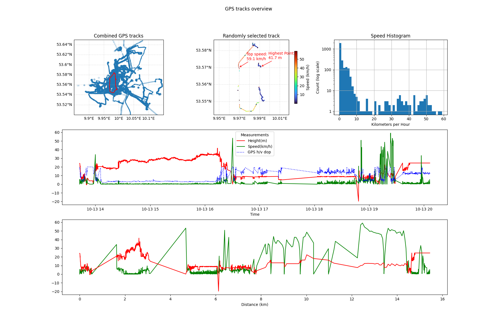

# GPX Explorer

*A tiny Python utility to parse GPX tracks, derive simple statistics, and visualise / render them*

---

## Why I built this

I have been recording a lot of GPX logs since moving to Hamburg, and wanted to create a simple project to visualise them and show some basic statistics, while learning matplotlib and pandas.

**What it does**

- **Parse GPX → DataFrame** with columns: `time` (UTC), `longitude`, `latitude`, `height` (m), `speed` (km/h), `distance` (km, cumulative), `hdop` (GPS accuracy).
- **Merge many tracks** in a directory into one combined DataFrame (and CSV for reuse).
- **Pick a random track** from a directory for the detailed plots.
- **Create visualisations**:
  - Combined scatter map for all points (opacity/size by HDOP).
  - Detailed map of one track coloured by speed with annotations for **top speed** and **highest point**.
  - **Speed histogram** (log‑scaled).
  - **Speed & height over time** plot.
  - **Speed & height over distance** plot.
- **Save an overview PNG** to a time‑stamped file under `Results/`.

> **Note**: Maps are static Matplotlib/Cartopy figures (plan to change to interactive maps in future).
---

## Demo



*(Tracks around Hamburg - red line highlights the randomly‑chosen ride; colour scale shows speed; annotations mark top speed & highest point.)*

---

## Installation

### Using Poetry (recommended)

```bash
# Clone this repository first, then:
poetry install
poetry run gpx-explorer --help
```

### Using pip

```bash
python -m venv .venv && source .venv/bin/activate   # Windows: .venv\Scripts\activate
pip install -r requirements.txt
# Optional: install the package locally to get the console script
pip install -e .
# Now the CLI should be available as `gpx-explorer`
```


*Python ≥ 3.10 is recommended.*

---

## Quick start (CLI)

Once installed (via Poetry or `pip install -e .`):

```bash
# Plot a single file quickly
gpx-explorer path/to/track.gpx

# Aggregate a directory of GPX files and plot all points
gpx-explorer tracks/

# Generate the full multi‑panel overview and save a PNG under Results/
gpx-explorer tracks/ --overview

# Rebuild the combined CSV even if it already exists
gpx-explorer tracks/ --overview -f
```

If you didn't install the console script, you can always run the module directly:

```bash
python -m gpx_explorer.cli tracks/ --overview
```

### CLI options

```
usage: gpx-explorer [-h] [--overview] [-f] target

Analyse and visualise GPX tracks.

positional arguments:
  target        A .gpx file or a directory containing .gpx files.

options:
  -h, --help    show this help message and exit
  --overview    Generate the full multi-panel overview PNG.
  -f, --force_csv
                Recreate 'combined_gpx_tracks.csv' even if it already exists.
```

---
### Outputs

- \`\` – written to the current working directory when you pass a directory. Reused on subsequent runs unless `-f/--force_csv` is given.
- \`\` – saved when `--overview` is used.

> The combined map currently uses hard‑coded extents around **Hamburg**. Adjust them in `plot_overview()` if your tracks are elsewhere. In future releases the overview will show the most frequented area.

---

## Development

- Type checking: `poetry run mypy`
- Tests & coverage: `poetry run pytest`
- Versioning & changelog: managed with **commitizen**. See `CHANGELOG.md`.

### Project layout

```
src/
  gpx_explorer/
    __init__.py
    cli.py
    core.py
    plotting.py
```

---

## Status & roadmap

The main branch corresponds to **v0.2.0** (changelog dated **2025‑07‑28**). Recent work added cumulative distance, log‑scaled histogram, colourbar for speed, a speed/height vs distance plot, and value annotations. See `CHANGELOG.md` for details.

**Possible next steps**

* Clean up graphs:
    * Auto adjust overview to contain most commonly visited areas
    * Make sure annotations stay within borders of graph, and don't overlap points or each other
    * Make sure gridlines have regular equal intervals
    * Correct formatting of time on x axis of speed vs time graph
    * Change combined view to heatmap
* Identify stops on the individual graph
    * Discount distance covered while at stop to impove accuracy of travel distance
* Use information from stops to cluster tracks 
* Elevation gain / loss, grade, movement time, distance covered stats for selected track.
* More tests and CI
* Publish package on PyPI (maybe)
---